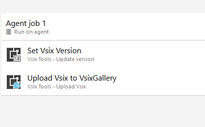

# Vsix Tools
Vsix Tools is an extension for Azure DevOps that populates the version in a vsix manifest file from a build.

# Set Vsix Version
Set the version field in the source.extension.vsixmanifest file

## Parameters

**Filename:**
Path to the source.extension.vsixmanifest file

**VersionNumber:**
Version number to use in the manifest file, must be a valid version eg. 4.5.12.0

# Upload Vsix to VsixGallery
Upload the vsix file to VsixGallery

## Parameters

**WorkingDirectory:**
Path to the folder containing the vsix file

## How to use the build task
### Configuration
1. Create or edit a build definition.
2. Click **Add build step...** and add the **Assembly Info** task from the Build category.
3. Move the **Vsix Tools** task to the desired position ensuring it precedes the Visual Studio Build task.  

  

4. Configure the task by providing values for the attributes mentioned in the above table. 

  

### Help and Support
Please visit our [wiki](https://github.com/sboulema/VsixTools/wiki) for articles describing how to configure the task parameters, including the various version formats supported by the extension.

## Contributions
We welcome all contributions whether it's logging bugs, creating suggestions or submitting pull requests.  
If you wish to contributions to this project head on over to our [GitHub](https://github.com/sboulema/VsixTools) page.

### Release Notes
See the [release notes](https://github.com/sboulema/VsixTools/releases) for all changes included in each release.